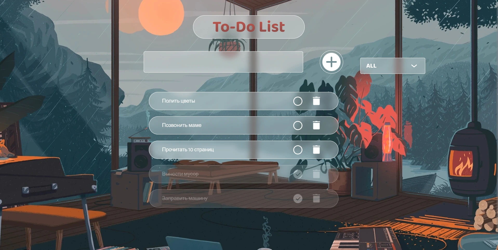

# 🌙 Lofi To-Do List

Уютный туду-лист с атмосферой lofi-комнаты, стеклянными задачами и плавными анимациями.



🔗 [Открыть приложение](https://serge-bogdanov.github.io/lofi-to-do-and-pomodoro/)

## ✨ Фичи

- 🧊 **Стеклянный дизайн** — морфизм, прозрачность, блюр
- 🎬 **Плавные анимации** — задачи перетекают при зачёркивании и удалении
- 📂 **Сортировка** — All / Incomplete / Completed
- 💾 **LocalStorage** — всё сохраняется между сессиями
- 🌌 **Lofi-атмосфера** — уютная комната на фоне

## 🛠 Технологии

- HTML, CSS, JavaScript
- FLIP-анимации (плавное перемещение всех элементов)
- LocalStorage API
- GitHub Pages

## 🎮 Как пользоваться

1. Введи задачу в поле ввода
2. Нажми `+` или Enter
3. Галочка — задача зачёркивается и плавно улетает вниз, остальные подтягиваются
4. Крестик — удаляет задачу с анимацией, список плавно сдвигается
5. Дропдаун фильтрует: All / Incomplete / Completed

## 🚀 Запуск локально

```bash
git clone https://github.com/serge-bogdanov/lofi-to-do-and-pomodoro.git
cd lofi-to-do-and-pomodoro
open index.html
```
